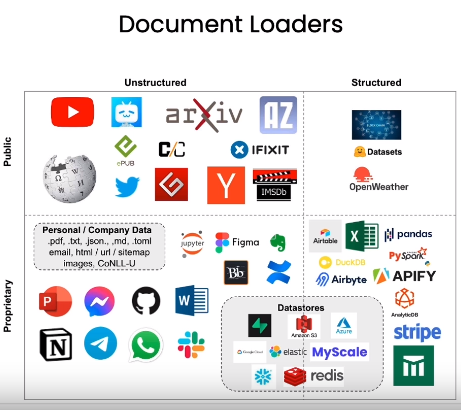

```python
# This is used  to hide the hard coded API key values
import os
import openai
import tiktoken
from dotenv import load_dotenv, find_dotenv
_ = load_dotenv(find_dotenv()) # read local .env file
​
openai.api_key  = os.environ['OPENAI_API_KEY']
```


- **Chain of Thought Reasoning** => Give the model time to think (for model with ~100B parameters)
- **Zero Shot Chain of Thought** => Appending the words "Let's think step by step." to the end of a question
- **Self-consistency** => Ask a model the same prompt multiple times & take the majority result as the final answer
- **Chaining Prompts** => Break down complex tasks


## Loader options

<p align="center">
    
</p>
